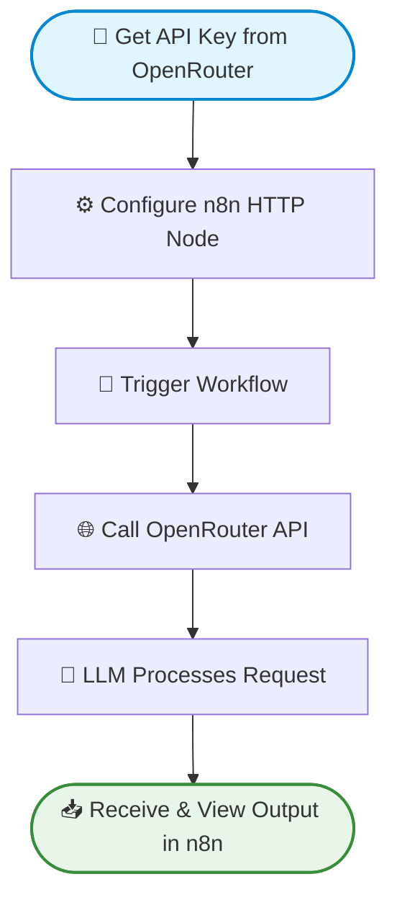

```mermaid
flowchart TD
    A([🔑 Get API Key from OpenRouter]) --> B[⚙️ Configure n8n HTTP Node]
    B --> C[🚀 Trigger Workflow]
    C --> D[🌐 Call OpenRouter API]
    D --> E[🧠 LLM Processes Request]
    E --> F([📥 Receive & View Output in n8n])
    
    style A fill:#e1f5fe,stroke:#0288d1,stroke-width:2px
    style F fill:#e8f5e9,stroke:#388e3c,stroke-width:2px
```
