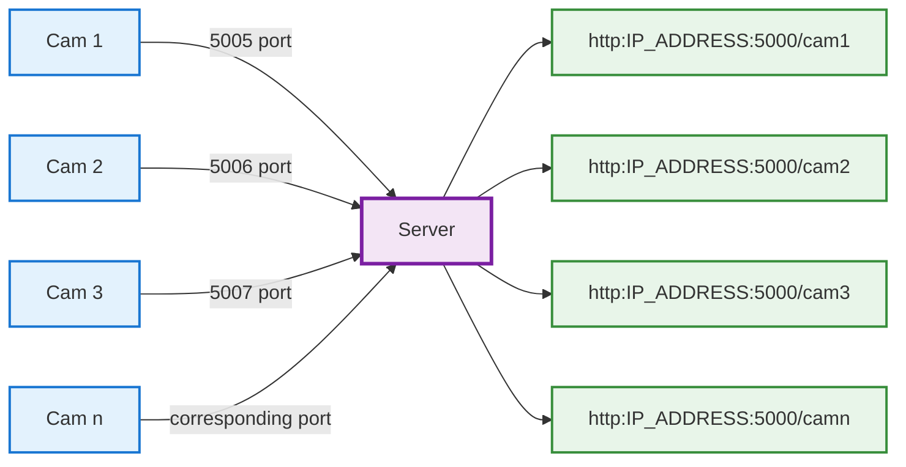

```mermaid
flowchart LR
    %% Cameras section
    Cam1[Cam 1] -- 5005 port --> Server[Server]
    Cam2[Cam 2] -- 5006 port --> Server
    Cam3[Cam 3] -- 5007 port --> Server
    CamN[Cam n] -- corresponding port --> Server

    %% Server exposes HTTP endpoints
    Server --> HTTP1[http:IP_ADDRESS:5000/cam1]
    Server --> HTTP2[http:IP_ADDRESS:5000/cam2]
    Server --> HTTP3[http:IP_ADDRESS:5000/cam3]
    Server --> HTTPN[http:IP_ADDRESS:5000/camn]

    classDef camera fill:#e3f2fd,stroke:#1976d2,stroke-width:2px;
    classDef server fill:#f3e5f5,stroke:#7b1fa2,stroke-width:3px;
    classDef endpoint fill:#e8f5e9,stroke:#388e3c,stroke-width:2px;

    class Cam1,Cam2,Cam3,CamN camera;
    class Server server;
    class HTTP1,HTTP2,HTTP3,HTTPN endpoint;
```
